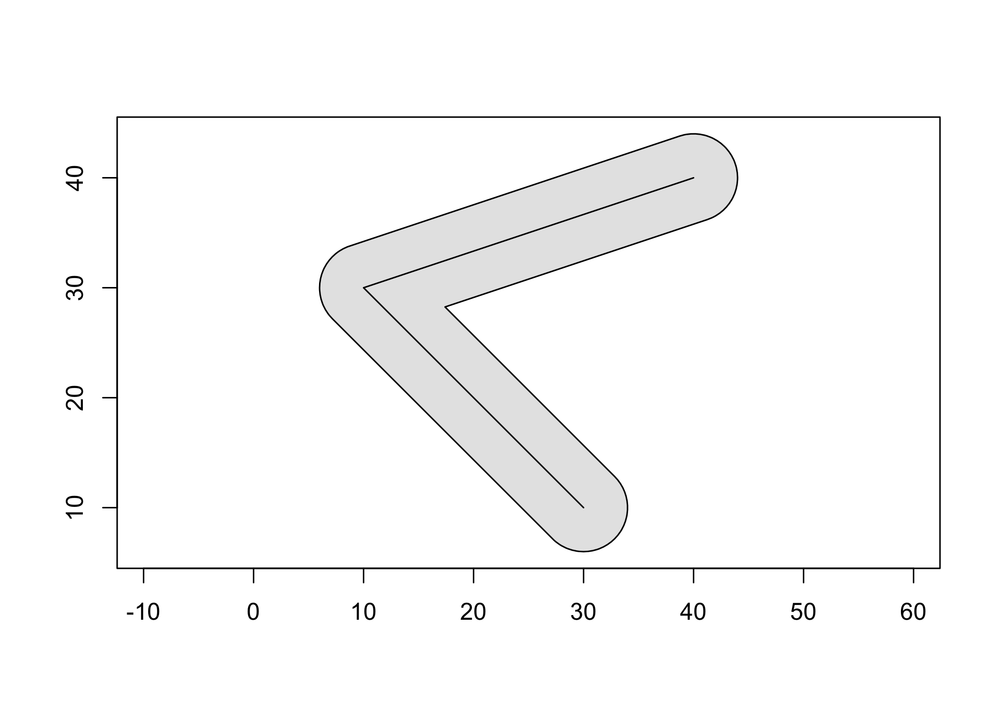

<!-- README.md is generated from README.Rmd. Please edit that file -->

# geos

<!-- badges: start -->
[](https://cran.r-project.org/package=geos)
[](https://app.codecov.io/gh/paleolimbot/geos?branch=master)
[](https://github.com/paleolimbot/geos/actions)
<!-- badges: end -->

The goal of geos is to provide access to the GEOS C API by vectorizing
the C functions for use in R. See the [package function
reference](https://paleolimbot.github.io/geos/reference/index.html) for
which functions are implemented in the R API.

## Installation

You can install the released version of geos from
[CRAN](https://CRAN.R-project.org) with:

``` r
install.packages("geos")
```

And the development version from [GitHub](https://github.com/) with:

``` r
# install.packages("remotes")
remotes::install_github("paleolimbot/geos")
```

If you can load the package, you’re good to go!

``` r
library(geos)
```

## Example

Buffer a line and plot it!

``` r
line <- as_geos_geometry("LINESTRING (30 10, 10 30, 40 40)")
plot(geos_buffer(line, distance = 4), col = "grey90")
plot(line, add = T)
```



The geos package is designed to work with
[dplyr](https://dplyr.tidyverse.org/) package, so you can work with
geometry vectors as a data frame column:

``` r
library(dplyr)
#> 
#> Attaching package: 'dplyr'
#> The following objects are masked from 'package:stats':
#> 
#>     filter, lag
#> The following objects are masked from 'package:base':
#> 
#>     intersect, setdiff, setequal, union

# map data from the maps package via ggplot2
states_df <- as_tibble(ggplot2::map_data("state"))
states_df
#> # A tibble: 15,537 × 6
#>     long   lat group order region  subregion
#>    <dbl> <dbl> <dbl> <int> <chr>   <chr>    
#>  1 -87.5  30.4     1     1 alabama <NA>     
#>  2 -87.5  30.4     1     2 alabama <NA>     
#>  3 -87.5  30.4     1     3 alabama <NA>     
#>  4 -87.5  30.3     1     4 alabama <NA>     
#>  5 -87.6  30.3     1     5 alabama <NA>     
#>  6 -87.6  30.3     1     6 alabama <NA>     
#>  7 -87.6  30.3     1     7 alabama <NA>     
#>  8 -87.6  30.3     1     8 alabama <NA>     
#>  9 -87.7  30.3     1     9 alabama <NA>     
#> 10 -87.8  30.3     1    10 alabama <NA>     
#> # … with 15,527 more rows

states_df %>% 
  group_by(region, group) %>% 
  summarise(geometry = geos_make_polygon(long, lat)) %>% 
  summarise(geometry = geos_make_collection(geometry, "multipolygon"))
#> `summarise()` has grouped output by 'region'. You can override using the
#> `.groups` argument.
#> # A tibble: 49 × 2
#>    region               geometry                                          
#>    <chr>                <geos_geom>                                       
#>  1 alabama              <MULTIPOLYGON [-88.476 30.241...-84.901 35.013]>  
#>  2 arizona              <MULTIPOLYGON [-114.809 31.347...-109.040 37.002]>
#>  3 arkansas             <MULTIPOLYGON [-94.624 32.997...-89.651 36.509]>  
#>  4 california           <MULTIPOLYGON [-124.383 32.538...-114.133 42.021]>
#>  5 colorado             <MULTIPOLYGON [-109.063 36.984...-102.044 41.018]>
#>  6 connecticut          <MULTIPOLYGON [-73.722 41.012...-71.780 42.049]>  
#>  7 delaware             <MULTIPOLYGON [-75.802 38.457...-75.052 39.849]>  
#>  8 district of columbia <MULTIPOLYGON [-77.137 38.806...-76.931 38.996]>  
#>  9 florida              <MULTIPOLYGON [-87.640 25.130...-80.042 31.008]>  
#> 10 georgia              <MULTIPOLYGON [-85.611 30.355...-80.844 34.996]>  
#> # … with 39 more rows
```

The easiest way to get data into and out of the package is using the [sf
package](https://r-spatial.github.io/sf/).

``` r
library(sf)
#> Linking to GEOS 3.11.0, GDAL 3.5.1, PROJ 9.0.1; sf_use_s2() is TRUE
nc <- read_sf(system.file("shape/nc.shp", package = "sf")) %>%
  st_transform(32119) # North Carolina state plane, m.

nc_geos <- as_geos_geometry(nc)

nc_geos %>% 
  geos_make_collection() %>% 
  geos_unary_union() %>% 
  st_as_sfc(nc_state)
#> Geometry set for 1 feature 
#> Geometry type: MULTIPOLYGON
#> Dimension:     XY
#> Bounding box:  xmin: 123829 ymin: 14744.69 xmax: 930521.8 ymax: 318259.9
#> Projected CRS: NAD83 / North Carolina
#> MULTIPOLYGON (((138426 177699.3, 145548.6 17783...
```
